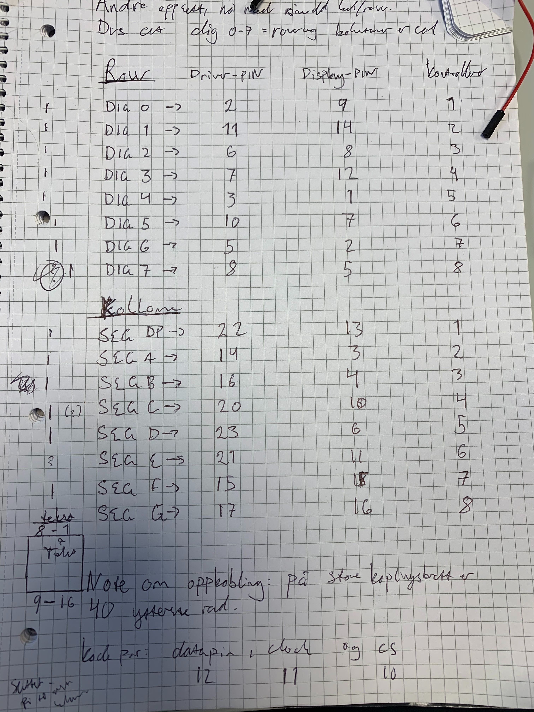

# Arbeidskrav - Embedded Systems 

## Overordnet 
I denne oppgaven har jeg koblet sammen en Arduino UNO med et 8x8 LED-display
ved hjelp av en MAX7219. Jeg har deretter skrevet et program som skriver ut 
scrollende tekst, slik som oppgaven krever. Programmet er skrevet med
LedControl-biblioteket. 

## Kobling 
Jeg har brukt dataark for [MAX7219](https://datasheets.maximintegrated.com/en/ds/MAX7219-MAX7221.pdf) og [matrisen](http://megtestesules.info/hobbielektronika/adatlapok/LED8x8_1088AS.pdf). 
Dataarkene brukte jeg til å lage min [egen oversikt](#skjema) over hvordan ting skulle kobles. 

Matrisen sitt dataark viser hvilken PIN på mtrisen som styrer hvilken kolonne/rad. Videre fant jeg ut at hver 
dig0-7 på MAX7219 gikk til rader og SIG DP og SIG A-G gikk til kolonner. Basert på denne informasjonen kunne 
jeg lage en oversikt over hvilke PINs på MAX7219 som skulle til forskjellige PINs på matrisen. 

Den konkrete oppkoblingen ligger i vedlagt Fritzing-fil.

## Virkemåte 
Matrisen fungerer i utgangspunktet slik: det dannes en krets ved å sette strøm gjennom en gitt kolonne og en gitt rad, 
med tilførsel i den ene enden og jording i den andre. Da lyser man opp en LED-paere. 

Dette er ikke nok; noen kombinasjoner er uforenelige med denne fremgangsmåten. Dette kommer man rundt 
ved at matrisen blinker fort. Det går så fort at våre mennesklige øyene ikke oppdager det. I tillegg 
sparer det strøm :) 

MAX7219 lar oss bruke matrisen uten å koble den rett i Arduino-en. Vi kommer unna med å bruke 3 PINs på
Arduino-brettet (ekskludert 5V og GND) istedenfor 16. Da har vi rom til å gjøre andre flere ting med Arduino-brettet samtidig. 
Vi kommer også unna med mindre resistans. 

# Skjema
